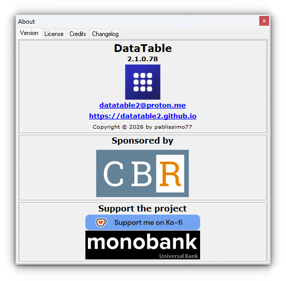

# DataTable

__DataTable2__ — це десктопна програма для роботи з __FRM-масивами__ (формат даних соціологічних/маркетингових досліджень). Програма написана на __Free Pascal / Lazarus__ (Delphi-сумісний режим) і компілюється під __Windows (win64)__ та __Linux (lin64)__.

По суті, це інструмент для __аналізу даних опитувань__ — аналог спрощеного SPSS для роботи з форматом даних FRM.

---

{data-gallery="About"}

## Що вміє програма?

- __Відкривати та зберігати FRM-масиви__ (бінарний формат даних опитувань)
- __Будувати таблиці__ (одновимірні та двовимірні таблиці: питання × розбивка)
- __Фільтрація__ анкет за формулою (власна мова фільтрів)
- __Зважування__ даних (weight)
- __Спліти__ (розбивка таблиць по групах)
- __Статистики__: відсотки, середні, медіана, стандартне відхилення, мін/макс, сума, Valid N
- __Значущість різниць__ (significance difference) між колонками, із попередньою колонкою, із колоною Тотал
- __ТопБокси / БоттомБокси__ (об'єднання альтернатив)
- __Трансформація__ — створення нових змінних 
- __Експорт таблиць в Excel (XLSX)__ — таблиці одразу формуються як Excel-файл
- __Експорт масиву в SPSS (.sav)__ — для подальшого аналізу в SPSS
- __Стилі таблиць__ — налаштування зовнішнього вигляду таблиць
- __Локалізація__ — українська та англійська мови інтерфейсу

---

## Подяка

Нові версії __DataTable__ вийшли за сприяння [__CBR__](https://cbr.com.ua) (Consumer and Business Research) — української компанії, що проводить маркетингові дослідження повного циклу.

