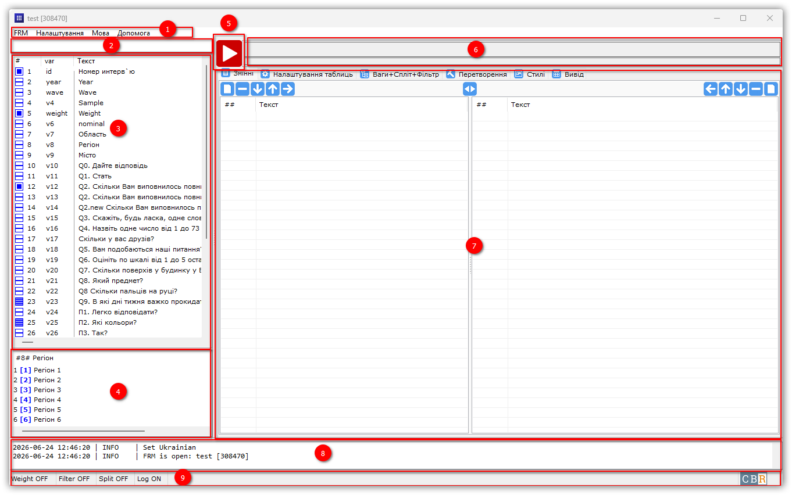
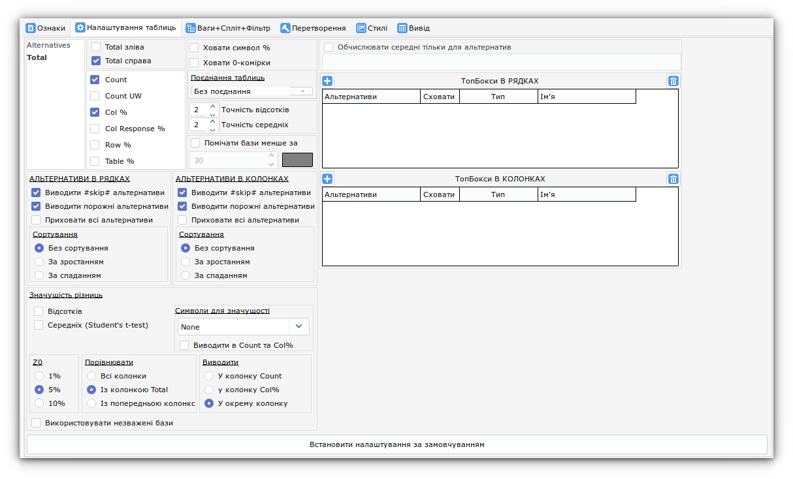

# Інтерфейс

{: data-gallery="interface_main_window_png"}
/// caption
Інтерфейс
///
## Елементи інтерфейсу

1. Головне меню
2. Швидкий пошук ознак
3. Вікно ознак
4. Вікно альтернатив
5. Кнопка Старт/Стоп
6. Прогрес-бар
7. Вікно вкладок
8. Вікно логування
9. Статус-бар

## Вкладки головного вікна

| Вкладка                  | Опис                                                       |
|--------------------------|------------------------------------------------------------|
| **Ознаки**               | Список питань масиву, перегляд альтернатив, швидкий фільтр |
| **Налаштування таблиць** | Рядки/колонки, статистики, значущість, бокси, сортування   |
| **Ваги+Спліт+Фільтр**    | Введення формули фільтра, збережені фільтри                |
| **Перетворення**         | Створення нових ознак за формулами                         |
| **Стилі**                | Управління стилями таблиць                                 |
| **Вивід**                | Перегляд побудованих таблиць (Excel), список файлів        |

---

{: data-gallery="interface_tab_signs_png"}
/// caption
Вкладка Ознаки
///
{: data-gallery="interface_tab_table_options_png"}
/// caption
Вкладка Налаштування таблиць
///
{: data-gallery="interface_tab_weight_split_filter_png"}
/// caption
Вкладка Ваги+Спліт+Фільтр
///
{: data-gallery="interface_tab_transformation_png"}
/// caption
Вкладка Перетворення
///
{: data-gallery="interface_tab_styles_png"}
/// caption
Вкладка Стилі
///
{: data-gallery="interface_tab_output_png"}
/// caption
Вкладка Вивід
///
