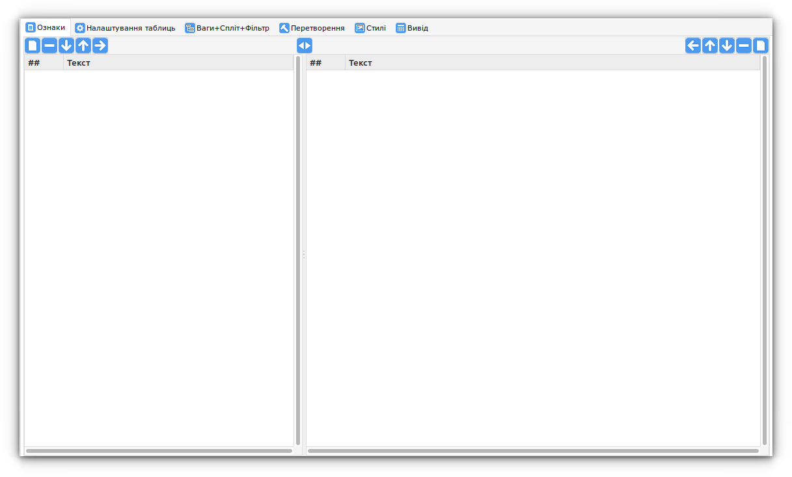
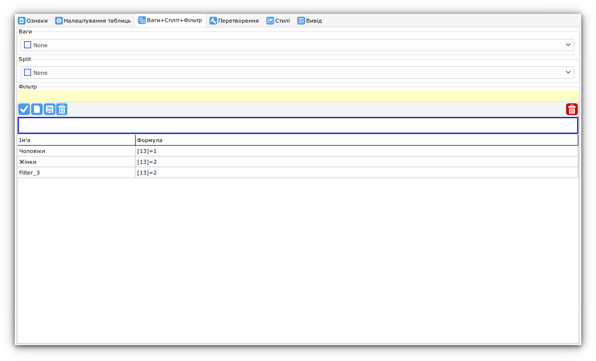
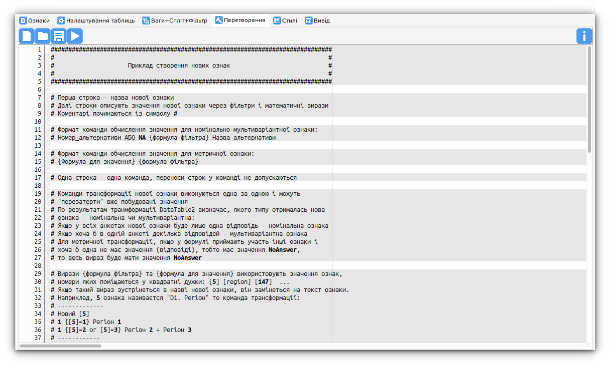
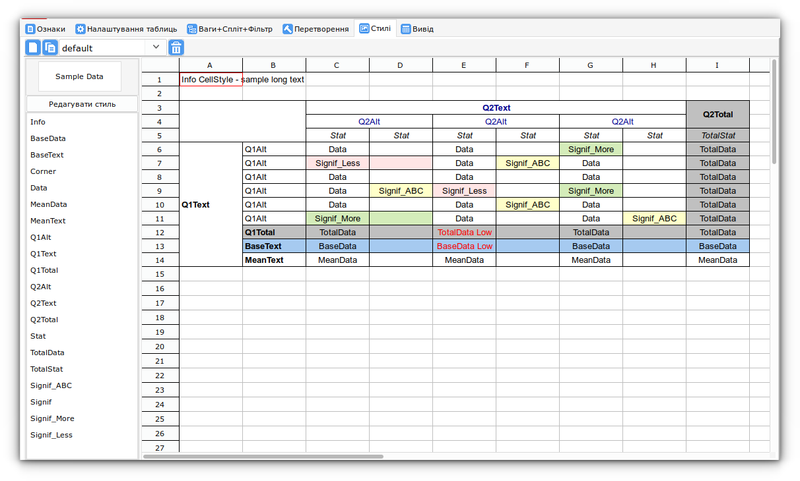
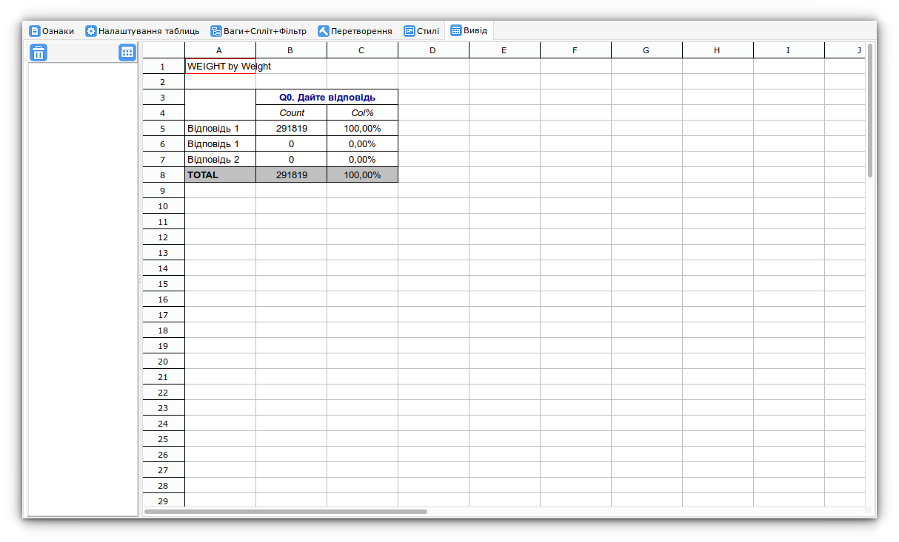

# Інтерфейс

/// caption
Інтерфейс
///
## Елементи інтерфейсу

1. Головне меню
2. Швидкий пошук ознак
3. [Вікно ознак](signs/index.md)
4. [Вікно альтернатив](signs/alts.md)
5. Кнопка Старт/Стоп
6. Прогрес-бар
7. [Вікно вкладок](tab_signs/index.md)
8. [Вікно логування](logging.md)
9. Статус-бар

## Вкладки головного вікна

| Вкладка                  | Опис                                                       |
|--------------------------|------------------------------------------------------------|
| **Ознаки**               | Список питань масиву, перегляд альтернатив, швидкий фільтр |
| **Налаштування таблиць** | Рядки/колонки, статистики, значущість, бокси, сортування   |
| **Ваги+Спліт+Фільтр**    | Введення формули фільтра, збережені фільтри                |
| **Перетворення**         | Створення нових ознак за формулами                         |
| **Стилі**                | Управління стилями таблиць                                 |
| **Вивід**                | Перегляд побудованих таблиць (Excel), список файлів        |

---

###  [Вкладка Ознаки](signs/index.md)

/// caption
Вкладка Ознаки
///
### [Вкладка Налаштування таблиць](tab_options/index.md)

Вкладка Налаштування таблиць
///
### [Вкладка Ваги+Спліт+Фільтр](tab_weight_split_filter/index.md)

/// caption
Вкладка Ваги+Спліт+Фільтр
///
### [Вкладка Перетворення](tab_transformation/index.md)

/// caption
Вкладка Перетворення
///
### [Вкладка Стилі](tab_styles/index.md)

/// caption
Вкладка Стилі
///
### [Вкладка Вивід](tab_output/index.md)

/// caption
Вкладка Вивід
///
