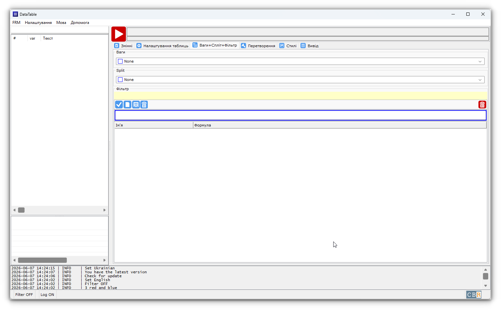

# Screenshots

## Ознаки
{ data-gallery="interface.main.png" }
/// caption
Ознаки (Windows 11)
///

{ data-gallery="interface.main.linux.png" }
/// caption
Ознаки (Linux Mint 22.3 - Cinnamon)
///

## Редагування ознаки
{ data-gallery="interface.sign.edit.png" }
/// caption
Редагування ознаки (Windows 11)
///

## Налаштування таблиць
{ data-gallery="interface.options.png" }
/// caption
Налаштування таблиць (Windows 11)
///
## Ваги, Спліт, Фільтри
{ data-gallery="interface.weight_split_filter.png" }
/// caption
Ваги, Спліт, Фільтри (Windows 11)
///
## Перетворення
{ data-gallery="interface.transform.png" }
/// caption
Перетворення (Windows 11)
///
## Стилі
{ data-gallery="interface.styles.png" }
/// caption
Стилі (Windows 11)
///
## Редагування стилю комірки
{ data-gallery="interface.style.edit.png" }
/// caption
Редагування стилю комірки (Windows 11)
///
## Вивід
{ data-gallery="interface.ouput.png" }
/// caption
Вивід (Windows 11)
///