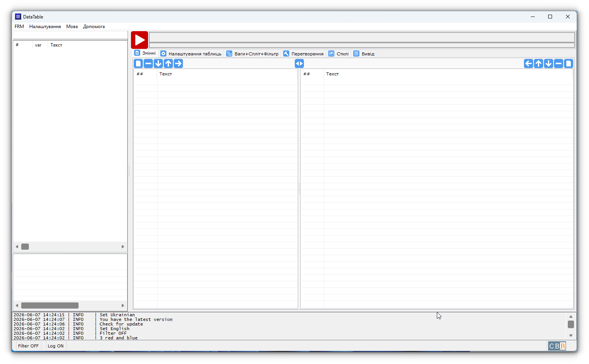
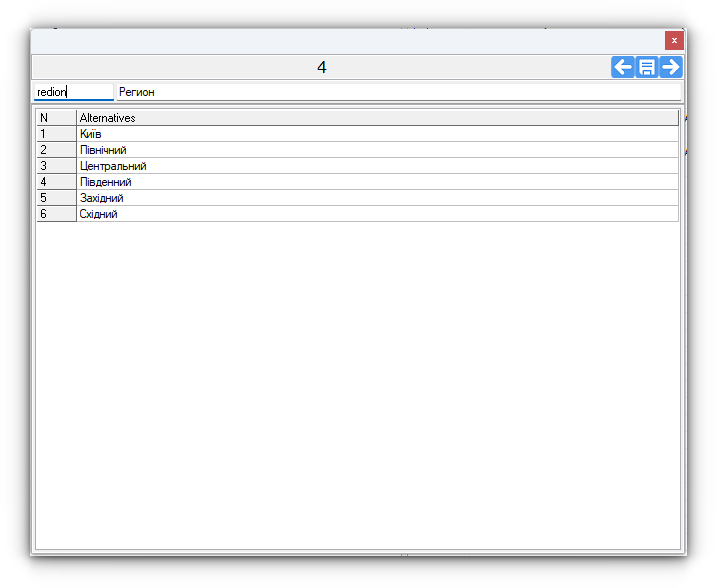
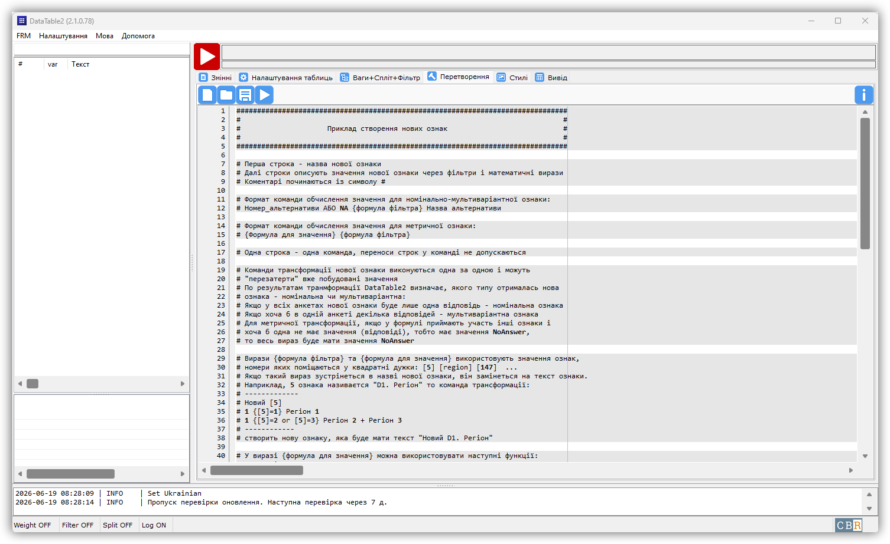
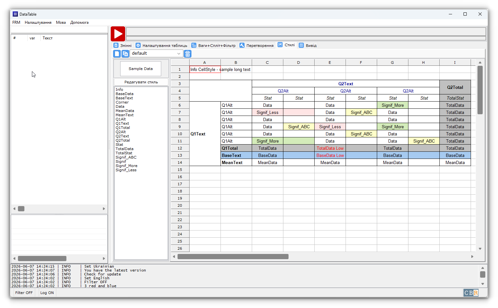
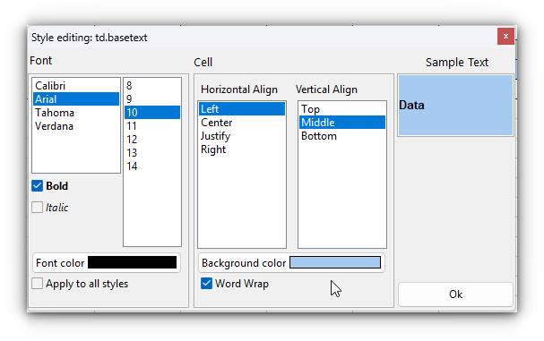

# Screenshots

## Ознаки

/// caption
Ознаки (Windows 11)
///

/// caption
Ознаки (Linux Mint 22.3 - Cinnamon)
///

## Редагування ознаки

Редагування ознаки (Windows 11)
///

## Налаштування таблиць

/// caption
Налаштування таблиць (Windows 11)
///
## Ваги, Спліт, Фільтри

/// caption
Ваги, Спліт, Фільтри (Windows 11)
///
## Перетворення

/// caption
Перетворення (Windows 11)
///
## Стилі

/// caption
Стилі (Windows 11)
///
## Редагування стилю комірки

/// caption
Редагування стилю комірки (Windows 11)
///
## Вивід

/// caption
Вивід (Windows 11)
///