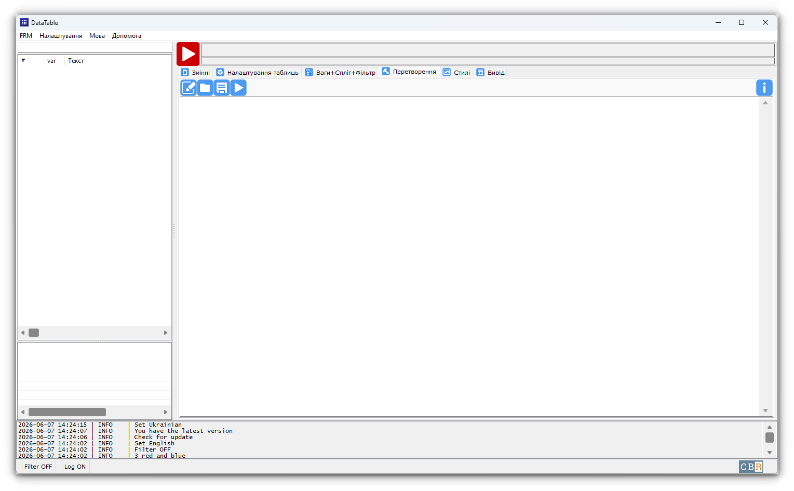

# Трансформація

## Загальна інформація

Закладка "Трансформація" дозволяє створювати нові ознаки всіх трьох типів.


/// caption
Перетворення (Windows 11)
///

### Панель з кнопками
Зверху знаходить панель із кнопками

| Кнопка                                                                                         | Опис                                  |
|------------------------------------------------------------------------------------------------|---------------------------------------| 
| {.off-glb width="21" } | Очищує текст редактора                |
| {.off-glb width="21" }   | Завантажує текст із файла в редактор  |
| {.off-glb width="21" }   | Зберігає текст редактора у файл       |
| {.off-glb width="21" }     | Запуск трансформації                  |
| {.off-glb width="21" }   | Вставка у редактор допоміжного тексту |

Нижче - редактор коду трансформацій

### Загальні правила синтаксису трансформацій:

* Кожна нова ознака описується блоком рядків, розділених порожнім рядком/рядками
* Перша строка (обов'язково!) - назва нової ознаки
* Далі в строках йдуть команди трансформації, одна строка - одна команда. Команди описують значення нової ознаки через фільтри й математичні вирази
* В синтаксисі дозволені строки-коментарі, які починаються із символу `#`
* Вираз `[Ознака]` використовується як у формулах значень та фільтрів, так у назві нової ознаки. Наприклад:
  В назві нової ознаки можна використовувати назви інших ознак:
  Вирази {формула для значення} використовують значення ознак,
  номери яких поміщаються у квадратні дужки: `[5]`, `[region]`, `[147]`...
  Якщо такий вираз зустрінеться в назві нової ознаки, він замінеться на текст ознаки.
  Наприклад, 5 ознака називається "D1. Регіон" то команда трансформації:
  
  ```linenums="1"
  Новий [5]
  1 {[5]=1} Регіон 1
  1 {[5]=2 or [5]=3} Регіон 2 + Регіон 3
  ```
  
  створить нову ознаку, яка буде мати текст `"Новий D1. Регіон"`

## Створення номінальних ти мультиваріантних ознак

Формат команди обчислення значення для номінально-мультиваріантної ознаки:

`Номер_альтернативи або NA { формула фільтра } Назва альтернативи`

Детальніше у розділі [Трансформація - створення номінальних та мультиваріантних ознак](make_nj.md)

## Трансформація - створення метричних ознак

Формат команди обчислення значення для метричної ознаки:

`{Формула для значення} {формула фільтра}`

Детальніше у розділі [Трансформація - створення метричних ознак](make_m.md)

## Збереження та завантаження

- Меню правої кнопки миші → **Зберегти** АБО кнопка {.off-glb width="21" } — зберігає текст редактора трансформацій у файл
- Меню правої кнопки миші → **Завантажити** АБО кнопка {.off-glb width="21" } — завантажує текст із файлу у редактор трансформацій
- Меню правої кнопки миші → **Вставити приклад** АБО кнопка {.off-glb width="21" } — вставляє наступний текст:

```python
################################################################################
#                                                                              #
#                     Приклад створення нових ознак                            #
#                                                                              #
################################################################################

# Перша строка - назва нової ознаки                                            
# Далі строки описують значення нової ознаки через фільтри і математичні вирази
# Коментарі починаються із символу #                                           

# Формат команди обчислення значення для номінально-мультиваріантної ознаки: 
# Номер_альтернативи АБО NA {формула фільтра} Назва альтернативи 

# Формат команди обчислення значення для метричної ознаки: 
# {Формула для значення} {формула фільтра}

# Одна строка - одна команда, переноси строк у команді не допускаються

# Команди трансформації нової ознаки виконуються одна за одною і можуть 
# "перезатерти" вже побудовані значення
# По результатам транмформації DataTable2 визначає, якого типу отрималась нова 
# ознака - номінальна чи мультиваріантна:
# Якщо у всіх анкетах нової ознаки буде лише одна відповідь - номінальна ознака
# Якщо хоча б в одній анкеті декілька відповідей - мультиваріантна ознака
# Для метричної трансформації, якщо у формулі приймають участь інші ознаки і 
# хоча б одна не має значення (відповіді), тобто має значення NoAnswer, 
# то весь вираз буде мати значення NoAnswer

# Вирази {формула фільтра} та {формула для значення} використовують значення ознак,
# номери яких поміщаються у квадратні дужки: [5] [region] [147]  ...
# Якщо такий вираз зустрінеться в назві нової ознаки, він замінеться на текст ознаки.
# Наприклад, 5 ознака називаєтся "D1. Регіон" то команда трансформації:
# -------------
# Новий [5]
# 1 {[5]=1} Регіон 1
# 1 {[5]=2 or [5]=3} Регіон 2 + Регіон 3 
# ------------
# створить нову ознаку, яка буде мати текст "Новий D1. Регіон"

# У виразі {формула для значення} можна використовувати наступні функції:
# SIN — сінус
# COS — косінус
# TG — тангенс
# CTG — котангенс
# LG — логарифм по основі 10
# LN — логарифм по основі e — иррациональная константа
# SQRT — квадратний корінь
# EXP — експонента
# PI — константа число пі

# Приклади номінально-мультиваріантної ознаки

Назва нової ознаки (Номінальна або мультиваріантна)
# Нова ознака буде дорівнювати 1 для тих анкет, в яких ознака 2 дорівнює 1 або 2
1 {[2]=1 or [2]=2} Альтернатива 1 
# Нова ознака буде дорівнювати 2 для тих анкет, в яких ознака 3 дорівнює 3
2 {[2]=3} Альтернатива 2 
# Нова ознака буде дорівнювати 3 для тих анкет, в яких ознака 2 більше-дорівнює 4 та менше-дорівнює 55
3 {[2]>=4 and [2]<=55} Альтернатива 3
# Нова ознака буде дорівнювати 4 для тих анкет, в яких у ознаці #5# нема відповідей - NoAnswer
4 {na(5)} Альтернатива 4
# Нова ознака буде дорівнювати 4 для тих анкет, в яких ознака 2 дорівнює 1
4 {[2]=1} Альтернатива 4 
# У нової ознаки не буде відповідей (NoAnswer) для тих анкет, в яких ознака 2 дорівнює 6
NA {[2]=6} Альтернатива 6
# Нова ознака буде дорівнювати 7 для тих анкет, в яких ознака region дорівнює 9
7 {[region]=9} Альтернатива 7
# Всі NoAnswer у новій ознаці, що лишилися після перетворень вище, будуть дорівнювати 8
8 {} Альтернатива 8

# Приклади номінально-мультиваріантної ознаки

Назва нової ознаки (Метрична)
{[2]*[3]*10*5 - [5] - 100/4 + SIN(1) + COS(1) - TG(5) - CTG(5) +LG(55)  + 2*LN(6)  + SQRT(4) + EXP(3) + 2*PI} {[2]=1 or [2]=2}
{5.75} {[2]=3}
{[2]} {}


# Приклад $loop_sign

$loop_sign: 55-57

Назва нової ознаки ($loop_sign)
1 {[$loop_sign]=1 or [$loop_sign]=2} Альтернатива 1 
2 {[$loop_sign]=3} Альтернатива 2 

# DataTable повторить три рази цей скрипт, підставляючи замість $loop_sign значення 55, 56, 57:

Назва нової ознаки (55)
1 {[55]=1 or [55]=2} Альтернатива 1 
2 {[55]=3} Альтернатива 2 

Назва нової ознаки (56)
1 {[56]=1 or [56]=2} Альтернатива 1 
2 {[56]=3} Альтернатива 2 

Назва нової ознаки (57)
1 {[57]=1 or [57]=2} Альтернатива 1 
2 {[57]=3} Альтернатива 2
```

---

