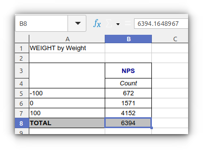

# 🚧 Зважування (Weight)

## Що означає зважування анкет
**Зважування** анкет означає сказати програмі, що деякі анкети повинні мати більший вплив на розрахунки, ніж інші. У звичайному незважаному наборі даних кожна анкета (рядок) зазвичай рахується як одна анкета. Коли активовано зважування, програма використовує значення змінної ваги, щоб визначити, скільки впливу повинна мати кожна анкета.

## Як увімкнути зважування

1. Оберіть метричну ознаку (`qm`) у випадаючому списку **Weight**
2. Програма автоматично присвоїть кожній анкеті вагу, рівну значенню обраної ознаки

!!! tip "Підказка"
    Програма автоматично підсвічує ознаки, у тексті яких є слово `weight`, `вага`, `ваги` або `вес`.

## Як вимкнути зважування

Оберіть `None` у випадаючому списку **Weight**. Усі ваги стануть рівними `1`.

## Як працює зважування

- Вага береться з метричної ознаки (тип `qm`)
- Якщо в анкеті значення ознаки = `NoAnswer` (немає відповіді), вага = `0`
- Зважування впливає на всі підрахунки: тотали, відсотки, середні тощо
- У статусній панелі відображається `Weight ON ##` або `Weight OFF`

Зважування може змінити відсотки в таблицях. Якщо одна група становить більш значну частину цільової сукупності, вона матиме більший вплив на зважені відсотки.

Зважена N може містити десяткові числа і значно відрізнятися від фактичної кількості анкет.
При виводі таких даних в Excel таблицях вони виводяться із цілочисельним форматуванням

---

## Чому зважена N відрізняється від незваженої?

Ваша зважена N відрізняється, тому що програма використовує змінну ваги для коригування внеску кожної анкети. 

**Приклад:**
- Фактична кількість анкет: 5213
- Зважена N: 6394.1648967

Це **не** означає, що ви опитали 6394.1648967 респондентів. Це означає, що аналіз оцінює скориговану кількість на основі змінної ваги.

{.off-glb}
---

## Як дізнатися, активне ли зважування?

Перевірте:
- Статус-бар програми
- Інформаційний текст на початку в побудованих таблицях
- Вікно логування
- Зайти на вкладку "Ваги-Спліт-Фільтр" і подивитися секцію "Ваги"
